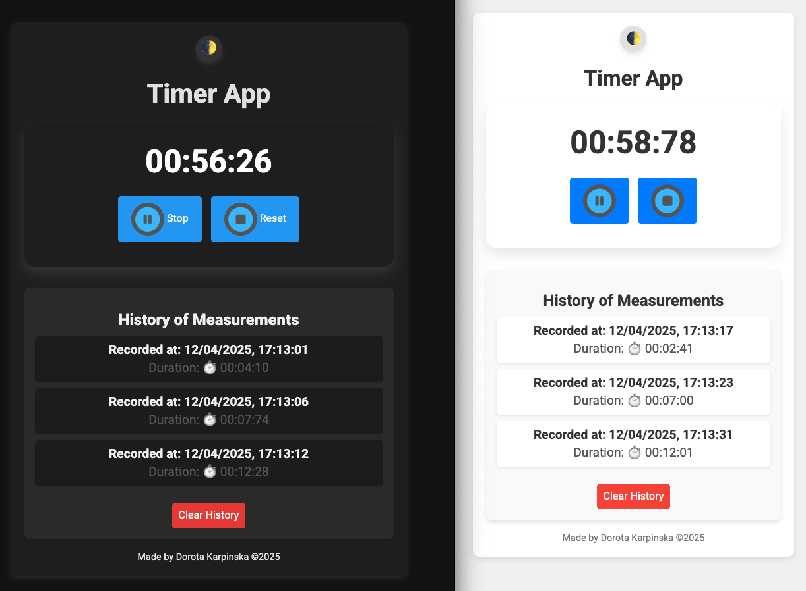

# ⏱️ Timer App (Vanilla JS)

A simple and minimalistic timer/stopwatch application built with **HTML**, **CSS**, and **Vanilla JavaScript**.

---

## 📦 Tech Stack

- **HTML5**
- **CSS3** (BEM methodology)
- **Vanilla JavaScript** (ES6+)

---

## 🚀 Live Demo

👉 [Timer App on GitHub Pages](https://dor-ka.github.io/frontend-vanilla-js-timer-app/)

---

## 🔧 Features

### 🎹 Keyboard Support

You can control the Timer using your keyboard:

- `Space` – Toggle **Start/Stop**
- `R` – **Reset** the Timer

💡 The `Space` key is debounced to prevent multiple triggers when held down.

💡 The `MediaPlayPause` key was considered but skipped due to inconsistent browser and OS support.

---

### 🔊 Sound Support

The Timer plays a **ticking sound** while running, which loops continuously until stopped or reset.

---

### 🌓 Dark Mode

Switch between **Light** and **Dark** mode using the button in the top-right corner.

🌙 Your preference is saved in `localStorage` and restored on reload.

---

### 📱 Responsive Design

The app is fully responsive and works well even on screens as small as **300px**.

---

## 🖼️ Screenshots

**Main Timer View**  


**Timer Running with History**  


---

## 📘 Version History

### v0.1
- [x] Basic HTML structure with display and buttons
- [x] Minimal styling
- [x] Added custom favicon and SEO meta tags
- [x] Integrated Google Fonts

### v0.2
- [x] Start / Stop / Reset logic
- [x] Display of minutes, seconds, and milliseconds

### v0.3
- [x] Ticking sound added while Timer is running

### v0.4
- [x] Simplified controls from 3 buttons to 2
- [x] Unified Start/Stop into a single toggle button with dynamic icon

### v0.5
- [x] Keyboard support (`Space` to Start/Stop, `R` to Reset)
- [x] Debounced `Space` key
- [x] `localStorage` support for time persistence across refreshes

### v0.6
- [x] "History of Measurements" section
- [x] Records session duration with date/time
- [x] Clear history button
- [x] Improved layout and small screen support

### v0.7
- [x] Added **Dark Mode**
- [x] Theme toggle button (🌓)
- [x] Theme preference saved to `localStorage`
- [x] Most recent measurement is pinned to the top

---

## 📁 Folder Structure

```
├── css
│   ├── dark-mode.css
│   ├── theme-toggle.css
│   ├── history.css
│   ├── style.css
│   └── timer.css
├── img
│   ├── favicon.ico
│   ├── og_image_v1.png
│   ├── btn_reset.png
│   ├── btn_start.png
│   ├── btn_stop.png
│   ├── screenshot_readme_01_v2.png
│   └── screenshot_readme_02_v2.png
├── js
│   └── script.js
├── sounds
│   └── tick.mp3
├── index.html
└── README.md
```
---

## 📄 License

This project is licensed under the **MIT License**.
