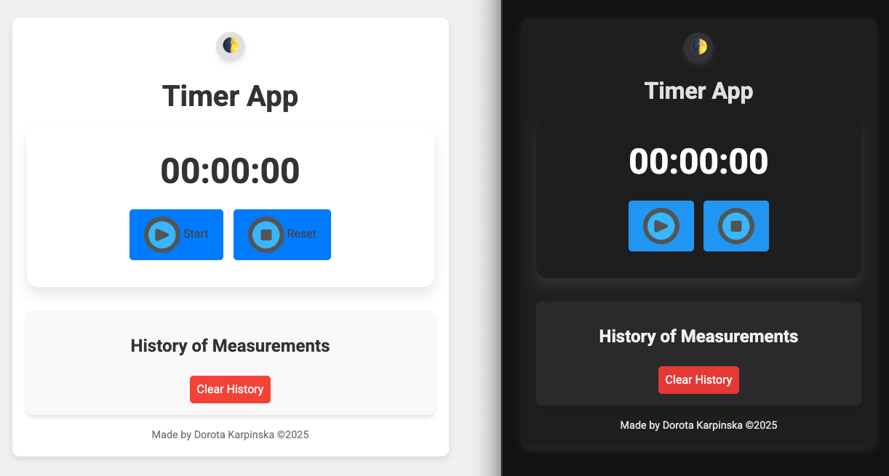

# ⏱️ Timer App (Vanilla JS)

A simple and minimalistic timer/stopwatch application built with **HTML**, **CSS**, and **Vanilla JavaScript**.

---

## 📦 Tech Stack

- HTML5
- CSS3 (BEM methodology)
- Vanilla JavaScript (ES6+)

---

## Supported Functions

### 🎹 Keyboard Support

You can control the timer using your keyboard:

- `Space` – toggle **Start/Stop**
- `R` – **Reset** the timer

> 💡 The `Space` key is now debounced to prevent multiple triggers when held down, improving control and preventing accidental multiple toggles.

> 💡 `MediaPlayPause` key was considered, but due to inconsistent browser and OS-level behavior, it wasn't implemented.

### 📢 Sound Support

The timer now plays a ticking sound while running, which loops until the timer is stopped or reset.

### 🌓 Dark Mode

You can now switch between **Light** and **Dark** mode using the button in the top-right corner.

> 🌙 The app remembers your preference using `localStorage`, so your theme stays consistent even after refreshing or closing the browser.

### 📱 Responsiveness

The app is fully responsive and works on screens as small as 300px.

---

## 🚀 Live Demo

👉 Check out the live demo on GitHub Pages: [Timer App (Vanilla JS)](https://dor-ka.github.io/frontend-vanilla-js-timer-app/)

---

## 🖼️ Screenshots

Here’s a preview of how the Timer App looks:   
*Main Timer View:*

*Timer Running with History:*

---

## 🔧 Features

### v0.1

- [x] Basic HTML structure with display and buttons
- [x] Minimalistic styling
- [x] Custom favicon added
- [x] SEO-friendly meta tags (Open Graph, Twitter Cards)
- [x] Google Fonts for improved typography

### v0.2

- [x] Start / Stop / Reset logic
- [x] Display minutes seconds and milliseconds
- [x] Timer logic and display updates

### v0.3

- [x] Added ticking sound while the timer is running
- [x] Sound loops during timer operation and stops when timer is stopped or reset

### v0.4

- [x] Simplified timer controls from 3 buttons to 2
- [x] Combined Start and Stop into a single toggle button
- [x] Updated UI icons to reflect button state (Start/Stop)

### v0.5

- [x] Added keyboard support using `Space` key to Start/Stop the timer
- [x] Implemented ticking sound that loops while the timer is running
- [x] Considered `MediaPlayPause` key but skipped due to inconsistent support
- [x] Added support for `R` key to reset the timer
- [x] Debounced `Space` key to prevent multiple triggers on key hold
- [x] Added time persistence with localStorage (timer state and current time are saved and restored after page refresh)

### v0.6

- [x] Added "History of Measurements" section
- [x] Timer records the duration of each session with date and time
- [x] Display history of recorded times with clear history button
- [x] UI improvements: Added headers for each history record, better layout
- [x] Added responsive design for small screens

### v0.7

- [x] Implemented **Dark Mode** support
- [x] Added **theme toggle button (🌓)** in top-right corner
- [x] User preference is saved in `localStorage` and auto-applied on load
- [x] Theme button styled to match light/dark appearance
- [x] Last measurement is now stored in localStorage and appears at the top of the history list

---

## 📁 Folder Structure

├── css   
&emsp;└── dark-mode.css  
&emsp;└── theme-toggle.css  
&emsp;└── history.css  
&emsp;└── style.css   
&emsp;└── timer.css   
└── img         
&emsp;└── favicon.ico   
&emsp;└── og_image_v1.png  
&emsp;└── btn_reset.png  
&emsp;└── btn_start.png  
&emsp;└── btn_stop.png  
&emsp;└── screenshot_readme_01_v2 .png  
&emsp;└── screenshot_readme_02_v2 .png  
├── js   
&emsp;└── script.js     
└── sounds         
&emsp;└── tick.mp3   
├── index.html    
└── README.md
---

## 📄 License

MIT